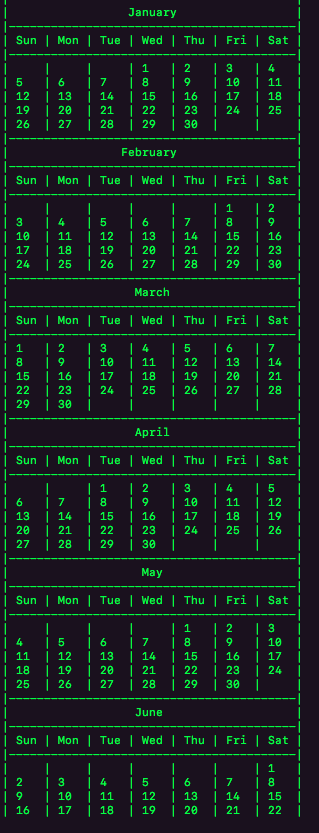
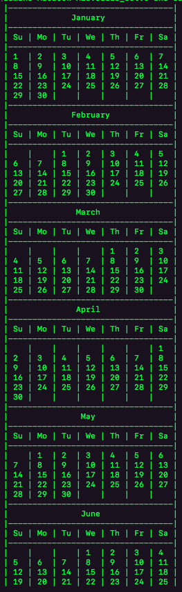

# calendar
#### This program prints a calender. It takes arguments indicating what the first day of the year is and how my letters of the days(eg. 3 for Mon, 4 for Mond, etc) should be printed. it then prints out the calender depending on the specifications given

#### to run, clone and when in the directly run
#### $ gcc q2_calendar.c -o q2_calendar
#### $ ./q2_calendar <number of letters in a day> <first day of the year>

